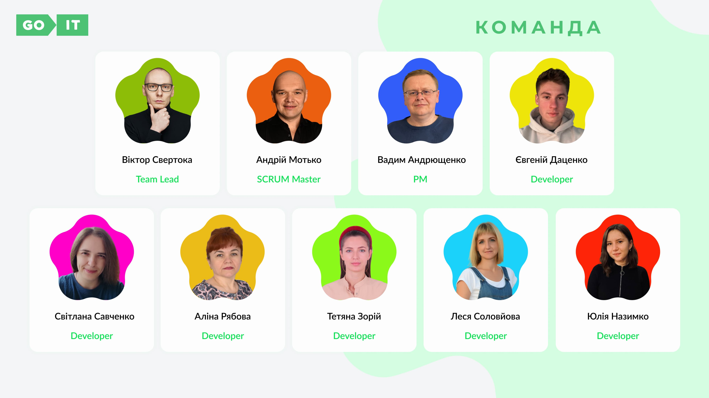

# Presentation

# Examples of writing commits on a project

## We use the following types of commits:

- Feat(HTML) Added new functionality

- Fix(JS) Error correction

- Perf(JPEG) Changes to improve performance

- Refactor(PNG) Code edits without fixing bugs or adding new features

- Revert(JS) Rollback to previous commits

- Style(SCSS) Code style edits

- Docs(README) Documentation update

Choose from the list the description of the commit that fits your task, in
brackets we write the file in which we worked, and in the body of the commit we
write what we did (changed) etc.

- `Look at Figma layout`
  [**Layout Figma**](https://www.figma.com/file/MrdZUmIfeT1bKd8u5GWLRt/English-Excellence-2.0?type=design&node-id=0-1&mode=design&t=4jJkOR8gcvoKgG1k-0)

npm run dev
